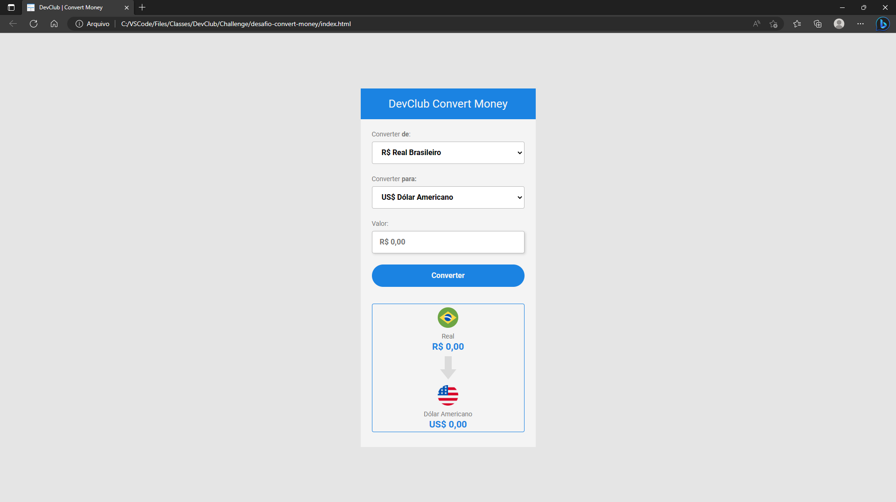
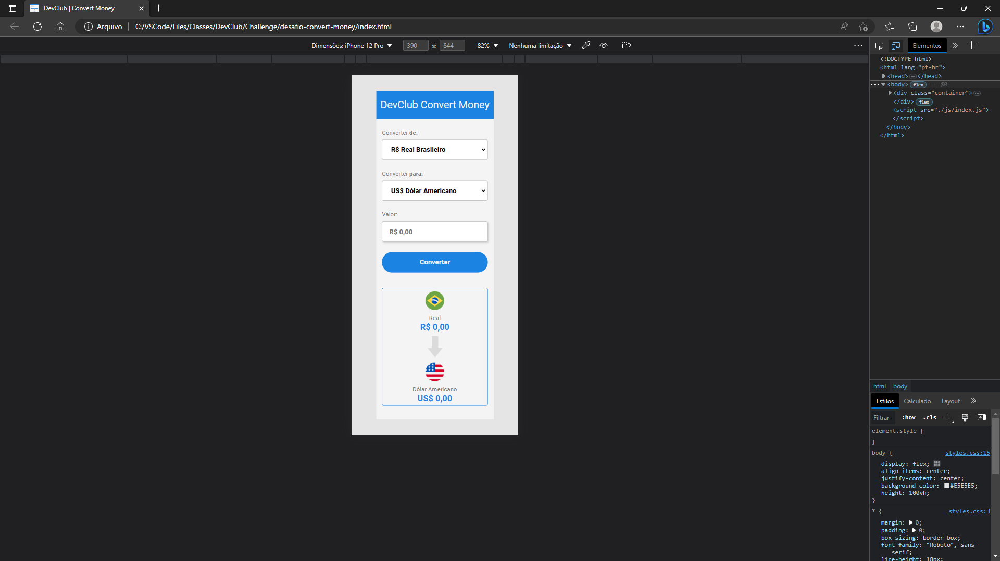

# 🚀 Desafios do DevClub 
Segue os desafios realizados no curso Full Stack do DevClub. 

# 🛠️ Linguagens e ferramentas:
   

1. desafio-easy-shopping. 🔗[Código!](https://github.com/ferreiraitalo/Desafios-Curso-DevClub/tree/main/desafio-easy-shopping) 🔗[Website!](https://desafio-easy-shopping-via-mobile.netlify.app)
2. desafio-we-care. 🔗[Código!](https://github.com/ferreiraitalo/Desafios-Curso-DevClub/tree/main/desafio-we-care) 🔗[Website!](https://desafio-we-care.netlify.app)
3. desafio-wide-coverage-location. 🔗[Código!](https://github.com/ferreiraitalo/Desafios-Curso-DevClub/tree/main/desafio-wide-coverage-location) 🔗[Website!](https://desafio-wide-coverage-location.netlify.app)
4. desafio-convert-money. 🔗[Código!](https://github.com/ferreiraitalo/Desafios-Curso-DevClub/tree/main/desafio-convert-money) 🔗[Website!](https://desafio-convert-money.netlify.app)

# 🖥️ Imagens / Visualizações:
### Primeiro desafio:
💻

📱

### Segundo desafio:
💻

📱

### Terceiro desafio:
💻

📱

### Quarto desafio:
💻

📱

