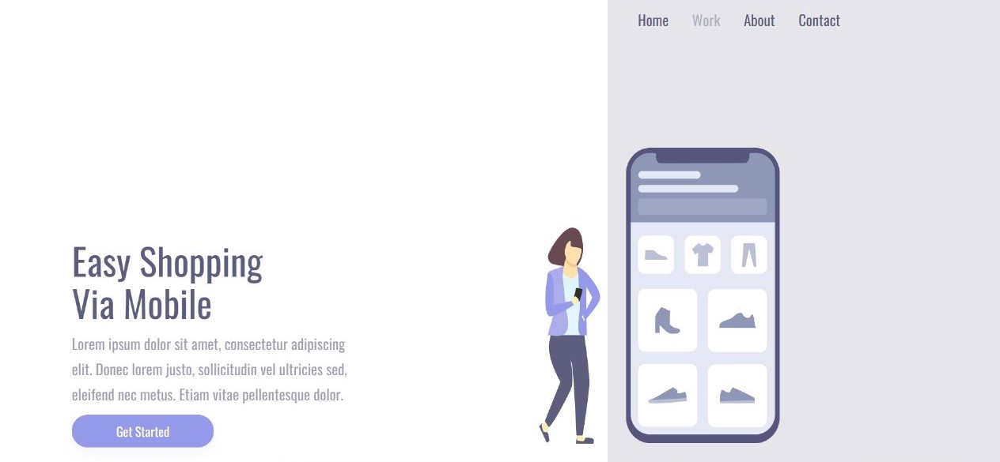
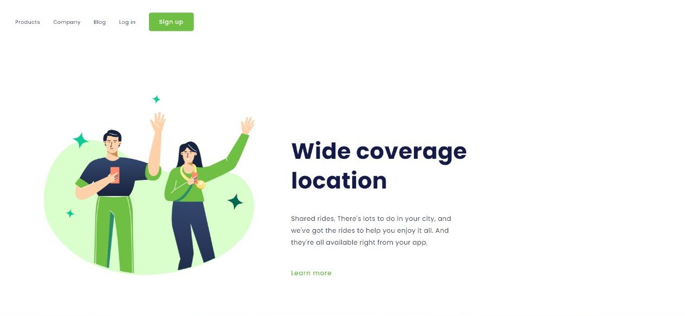

# Desafios do DevClub 🚀
Segue os desafios realizados no curso Full Stack do DevClub.💻🖥️📱
## Linguagens e ferramentas:
  

1. desafio-easy-shopping. [Código!](https://github.com/ferreiraitalo/Desafios-Curso-DevClub/tree/main/desafio-easy-shopping)🔗
2. desafio-we-care. [Código!](https://github.com/ferreiraitalo/Desafios-Curso-DevClub/tree/main/desafio-we-care)🔗
3. desafio-wide-coverage-location. [Código!](https://github.com/ferreiraitalo/Desafios-Curso-DevClub/tree/main/desafio-wide-coverage-location)🔗

## Imagens / Visualizações:
#### Primeiro desafio:

#### Segundo desafio:

#### Terceiro desafio:

